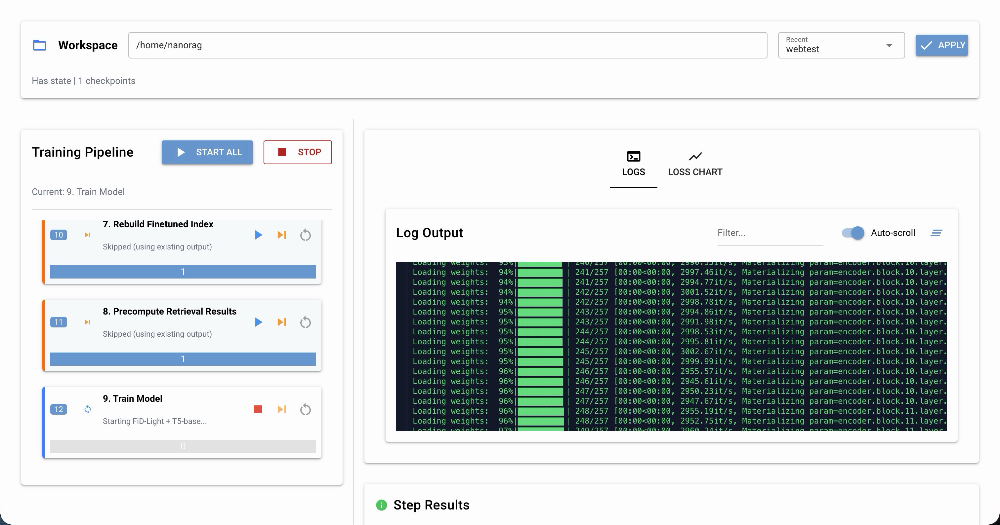
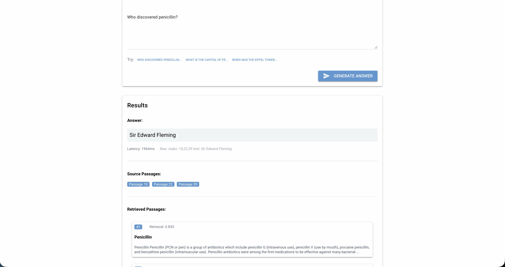
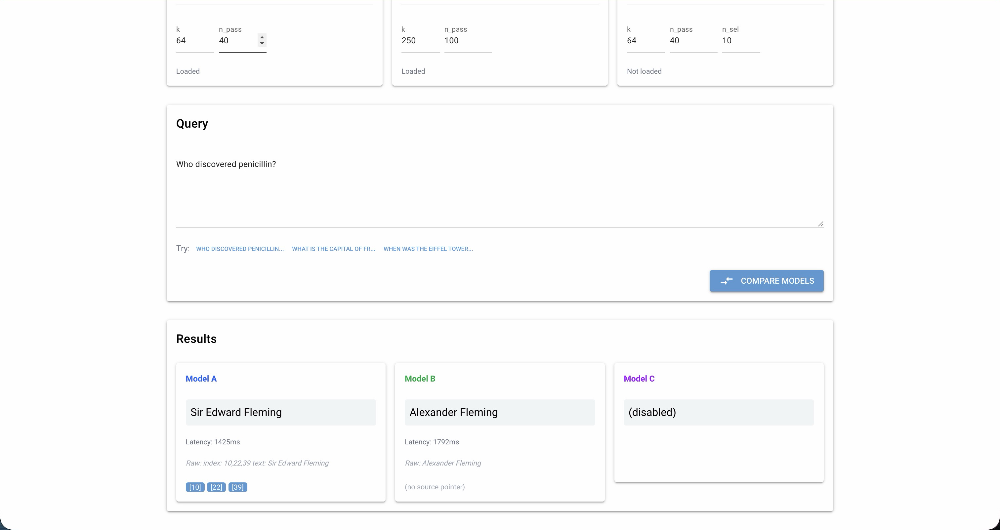
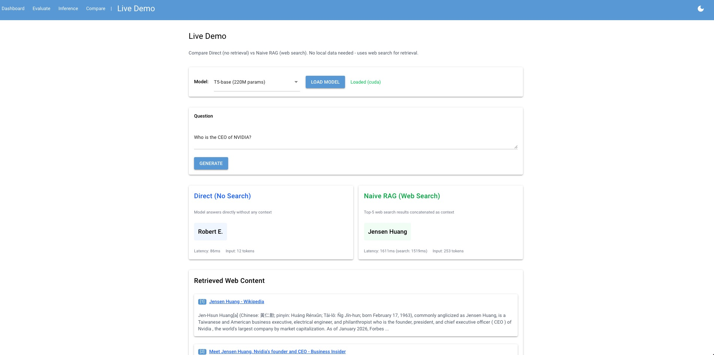

<p align="center">
  <a href="https://opensource.org/licenses/MIT"></a>
  <a href="https://www.python.org/downloads/"></a>
  <a href="https://pytorch.org/"></a>
  <a href="https://nicegui.io/"></a>
</p>

# EasyRAG: A Beginner-friendly and Interactive Framework for Retrieval-Augmented Generation

**EasyRAG** is an open-source framework providing faithful implementations of five RAG algorithms — from simple baselines to advanced methods — with an interactive web dashboard for training, evaluation, and inference. It includes the **first publicly available implementations** of [FiD-Light](https://dl.acm.org/doi/abs/10.1145/3539618.3591687) (encoder compression + Source Pointing) and [Stochastic RAG](https://dl.acm.org/doi/10.1145/3626772.3657923) (Gumbel-Top-k differentiable reranking), designed for accessibility, reproducibility, and education.

---

## Table of Contents

- [EasyRAG: A Beginner-friendly and Interactive Framework for Retrieval-Augmented Generation](#easyrag-a-beginner-friendly-and-interactive-framework-for-retrieval-augmented-generation)
  - [Table of Contents](#table-of-contents)
  - [Key Features](#key-features)
  - [Supported Algorithms](#supported-algorithms)
  - [Screenshots](#screenshots)
  - [Demo Video](#demo-video)
  - [Installation](#installation)
    - [Prerequisites](#prerequisites)
    - [Setup](#setup)
  - [Quick Start](#quick-start)
    - [Rapid Prototyping (No Data Download)](#rapid-prototyping-no-data-download)
    - [Web Dashboard](#web-dashboard)
  - [Full Training Pipeline](#full-training-pipeline)
    - [Step 1: Download and Prepare Data](#step-1-download-and-prepare-data)
    - [Step 2–3: Build Retrieval Index](#step-23-build-retrieval-index)
    - [Step 4: Train Retriever (optional)](#step-4-train-retriever-optional)
    - [Step 5: Precompute Retrieval](#step-5-precompute-retrieval)
    - [Step 6: Train Models](#step-6-train-models)
    - [Step 7: Evaluate](#step-7-evaluate)
  - [Evaluation](#evaluation)
  - [Project Structure](#project-structure)
  - [Acknowledgments](#acknowledgments)
  - [License](#license)

---

## Key Features

- **5 RAG Algorithms** — LLM-Only Generation, Naive RAG, FiD, FiD-Light, and Stochastic RAG in a unified codebase
- **First Open-Source FiD-Light & Stochastic RAG** — Faithful reproductions following original papers' algorithms and hyperparameters
- **Modular 7-Step Pipeline** — From data download to evaluation, each step independently runnable and resumable
- **Interactive Web Dashboard** — NiceGUI-based UI for pipeline management, real-time training monitoring, and inference
- **Rapid Prototyping** — Instant RAG demonstration with DuckDuckGo web search, no dataset download required
- **Multi-Backbone** — Supports T5-Base (220M) and T5Gemma2 (270M encoder + 270M decoder)
- **Hardware Accessible** — Runs on any CUDA-enabled NVIDIA GPU, from a single consumer GPU to multi-GPU clusters
- **KILT Benchmark** — Evaluation on NQ, TriviaQA, and HotpotQA with EM, F1, KILT-EM, and KILT-F1 metrics

---

## Supported Algorithms

| Algorithm | Description |
|:---|:---|
| **LLM-Only Generation** | Answer from parametric knowledge only, no retrieval |
| **Naive RAG** | Concatenate top-k retrieved passages into a single input |
| **[FiD](https://aclanthology.org/2021.eacl-main.74/)** | Encode passages independently, fuse in decoder cross-attention |
| **[FiD-Light](https://dl.acm.org/doi/abs/10.1145/3539618.3591687)** | FiD + encoder compression (top-k vectors) + Source Pointing |
| **[Stochastic RAG](https://dl.acm.org/doi/10.1145/3626772.3657923)** | End-to-end differentiable passage reranking via Gumbel-Top-k |

---

## Screenshots

<p align="center">
  
  <br><em>Training pipeline dashboard with real-time loss curves and step status indicators.</em>
</p>

<p align="center">
  
  <br><em>Interactive inference with retrieved passages and Source Pointing visualization.</em>
</p>

<p align="center">
  
  <br><em>Side-by-side comparison of multiple RAG algorithms on the same query.</em>
</p>

<p align="center">
  
  <br><em>Live Demo comparing Closed-book and Naive RAG using real-time DuckDuckGo web search, no dataset download required.</em>
</p>

---

## Demo Video

📹 **[Watch Demo Video](https://github.com/ii-research/EasyRAG/releases/tag/demo)** — Showcasing the training pipeline, inference interface, and rapid prototyping features.

---

## Installation

### Prerequisites

- Python 3.9+
- CUDA-capable NVIDIA GPU (8GB+ VRAM for T5-Base)
- CUDA 12.1

### Setup

```bash
# 1. Clone the repository
git clone https://github.com/ii-research/EasyRAG.git
cd EasyRAG

# 2. Install PyTorch with CUDA 12.1
pip install torch torchvision torchaudio --index-url https://download.pytorch.org/whl/cu121

# 3. Install Faiss GPU
pip install faiss-gpu-cu12==1.13.2

# 4. Install remaining dependencies
pip install -r requirements.txt
```

<details>
<summary><b>Key dependencies</b></summary>

| Package | Purpose |
|:---|:---|
| `transformers` | Model loading and tokenization |
| `sentence-transformers` | GTR-T5-Base retriever |
| `faiss-gpu` | Dense vector similarity search |
| `nicegui` | Web dashboard UI |
| `ddgs` | DuckDuckGo search (live demo) |
| `datasets` | KILT data loading |
| `tensorboard` | Training visualization |

</details>

---

## Quick Start

### Rapid Prototyping (No Data Download)

Try RAG instantly using web search — no Wikipedia download or pre-training required:

```bash
# Interactive mode
python web_demo/web_rag_demo.py --interactive --model t5base

# Single query
python web_demo/web_rag_demo.py --query "Who directed Parasite?" --mode naive_rag --model t5base

# Compare: Naive RAG vs. Closed-book (Direct)
python web_demo/web_rag_demo.py --query "Who directed Parasite?" --mode direct --model t5base
```

### Web Dashboard

Launch the full web interface for pipeline management, training, inference, and model comparison:

```bash
python -m web_demo.app
# Open http://localhost:8080
```

The dashboard provides five pages:

| Page | Function |
|:---|:---|
| **Dashboard** | Pipeline overview with step status, real-time loss curves, log streaming |
| **Evaluate** | Run evaluation on checkpoints with configurable metrics |
| **Inference** | Interactive Q&A with any trained model, Source Pointing visualization |
| **Compare** | Side-by-side comparison of multiple algorithms on the same query |
| **Rapid Prototyping** | Closed-book vs. Naive RAG with DuckDuckGo web search |

---

## Full Training Pipeline

EasyRAG implements a modular 7-step pipeline. Each step is independent and can be skipped if pre-trained artifacts are available.

```
Download & Preprocess ──> Build Index ──> Train Retriever ──> Precompute ──> Train Model ──> Evaluate
     [Step 1]              [Step 2-3]       [Step 4]          [Step 5]       [Step 6]       [Step 7]
```

### Step 1: Download and Prepare Data

```bash
python data_pipeline/download_kilt_data.py    # Download KILT Wikipedia + NQ, TriviaQA, HotpotQA
python data_pipeline/fix_triviaqa.py          # Fix TriviaQA missing question text
python data_pipeline/filter_kilt_data.py      # Filter samples without valid provenance
```

### Step 2–3: Build Retrieval Index

```bash
python data_pipeline/build_wiki_index.py    # Convert Wikipedia to Arrow format
python data_pipeline/build_gtr_index.py     # Build Faiss index with GTR-T5-Base embeddings
```

### Step 4: Train Retriever (optional)

```bash
python data_pipeline/generate_retrieval_training_data.py    # Generate training triplets
python training/train_gtr_retriever.py                      # Fine-tune GTR retriever
```

### Step 5: Precompute Retrieval

```bash
# For FiD-Light / Stochastic RAG (top-40 passages)
python data_pipeline/precompute_retrieval.py

# For FiD (top-100 passages)
python data_pipeline/precompute_retrieval_for_fid.py
```

### Step 6: Train Models

| Algorithm | T5-Base | T5Gemma2 |
|:---|:---|:---|
| Closed-book (Direct) | `training/train_direct.py` | `training/train_direct_t5gemma.py` |
| Naive RAG | `training/train_naive_rag.py` | `training/train_naive_rag_t5gemma.py` |
| FiD | `training/train_fid_pure.py` | `training/train_fid_pure_t5gemma.py` |
| FiD-Light | `training/train_fidlight_paper.py` | `training/train_fidlight_t5gemma.py` |
| Stochastic RAG | `training/train_stochastic_rag.py` | `training/train_stochastic_rag_t5gemma.py` |

Common options:

```bash
python training/train_fidlight_paper.py \
    --precomputed_path data/precomputed/all_tasks_train.parquet \
    --output_dir checkpoints/fidlight \
    --steps 50000 \
    --multi_gpu           # Use all available GPUs
    --resume checkpoint/  # Resume from checkpoint
```

### Step 7: Evaluate

```bash
# Single checkpoint
python evaluation/evaluate_fidlight.py --checkpoint checkpoints/fidlight/final --task nq

# All checkpoints in a directory
python evaluation/evaluate_fidlight_t5base_all_checkpoints.py \
    --checkpoint_dir checkpoints/fidlight/
```

---

## Evaluation

EasyRAG evaluates on three KILT benchmark tasks with four metrics:

| Metric | Description |
|:---|:---|
| **EM** (Exact Match) | Whether the predicted answer exactly matches any gold answer |
| **F1** | Token-level F1 between prediction and gold answer |
| **KILT-EM** | EM conditioned on correct provenance (Source Pointing) |
| **KILT-F1** | F1 conditioned on correct provenance |

Evaluation scripts are provided for each algorithm and backbone combination. All scripts support `--task` (nq, triviaqa, hotpotqa, or all) and `--multi_gpu` options.

For detailed experimental results, please refer to the paper.

---

## Project Structure

```

EasyRAG/
├── data_pipeline/                         # Data processing & precomputation
│   ├── download_kilt_data.py              #   Step 1: Download KILT datasets
│   ├── fix_triviaqa.py                    #   Step 1: Fix TriviaQA format
│   ├── filter_kilt_data.py                #   Step 1: Filter invalid samples
│   ├── build_wiki_index.py                #   Step 2: Build Wikipedia Arrow index
│   ├── build_gtr_index.py                 #   Step 3: Build Faiss index
│   ├── generate_retrieval_training_data.py#   Step 4: Generate retriever training data
│   ├── precompute_retrieval.py            #   Step 5: Precompute passages (top-40)
│   └── precompute_retrieval_for_fid.py    #   Step 5: Precompute passages (top-100)
│
├── training/                              # Model training scripts
│   ├── train_gtr_retriever.py             #   Step 4: Fine-tune GTR retriever
│   ├── train_direct.py                    #   Closed-book (T5-Base)
│   ├── train_naive_rag.py                 #   Naive RAG (T5-Base)
│   ├── train_fid_pure.py                  #   FiD (T5-Base)
│   ├── train_fidlight_paper.py            #   FiD-Light (T5-Base)
│   ├── train_stochastic_rag.py            #   Stochastic RAG (T5-Base)
│   └── train_*_t5gemma.py                 #   T5Gemma2 variants of each algorithm
│
├── evaluation/                            # Evaluation scripts
│   ├── evaluate_retriever.py              #   Retriever evaluation
│   ├── evaluate_*.py                      #   Per-algorithm evaluation (single & all checkpoints)
│   └── evaluate_*_t5gemma*.py             #   T5Gemma2 evaluation variants
│
├── utils/                                 # Shared modules
│   ├── kilt_loader.py                     #   KILT dataset loader
│   ├── gtr_retriever.py                   #   GTR dense retriever module
│   └── multitask_loader.py                #   Multi-task training data sampler
│
├── web_demo/                              # Web dashboard (NiceGUI)
│   ├── app.py                             #   Entry point: python -m web_demo.app
│   ├── web_rag_demo.py                    #   Standalone live demo (CLI)
│   ├── pipeline_orchestrator.py           #   Pipeline step management
│   ├── inference_demo.py                  #   Inference engine
│   ├── state_monitor.py                   #   Real-time state monitoring
│   ├── components/
│   │   ├── pipeline_overview.py           #   Pipeline visualization
│   │   ├── step_dialog.py                 #   Step configuration dialogs
│   │   ├── log_viewer.py                  #   Log viewer & loss charts
│   │   ├── inference_panel.py             #   Interactive Q&A
│   │   ├── compare_panel.py               #   Side-by-side model comparison
│   │   ├── evaluate_panel.py              #   Evaluation UI
│   │   ├── web_rag_panel.py               #   Live demo (web search RAG)
│   │   └── workspace_selector.py          #   Workspace management
│   └── utils/
│       ├── process_manager.py             #   Subprocess management
│       └── state_io.py                    #   Pipeline state persistence
│
├── figures/                               # Screenshots for README
├── requirements.txt
└── LICENSE                                # MIT License
```

---

## Acknowledgments

EasyRAG builds upon the following works:

- **FiD** — Izacard & Grave. [Leveraging Passage Retrieval with Generative Models for Open Domain Question Answering](https://aclanthology.org/2021.eacl-main.74/). EACL 2021.
- **FiD-Light** — Hofstatter et al. [FiD-Light: Efficient and Effective Retrieval-Augmented Text Generation](https://dl.acm.org/doi/abs/10.1145/3539618.3591687). SIGIR 2023.
- **Stochastic RAG** — Zamani & Bendersky. [Stochastic RAG: End-to-End Retrieval-Augmented Generation through Expected Utility Maximization](https://dl.acm.org/doi/10.1145/3626772.3657923). SIGIR 2024.
- **KILT** — Petroni et al. [KILT: a Benchmark for Knowledge Intensive Language Tasks](https://aclanthology.org/2021.naacl-main.200/). NAACL 2021.
- **GTR** — Ni et al. [Large Dual Encoders Are Generalizable Retrievers](https://arxiv.org/abs/2112.07899). 2021.
- **T5Gemma2** — Zhang et al. [T5Gemma 2: Seeing, Reading, and Understanding Longer](https://arxiv.org/abs/2512.14856). 2025.

---

## License

This project is licensed under the MIT License. See [LICENSE](LICENSE) for details.
